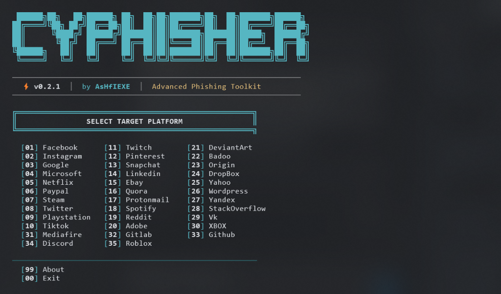
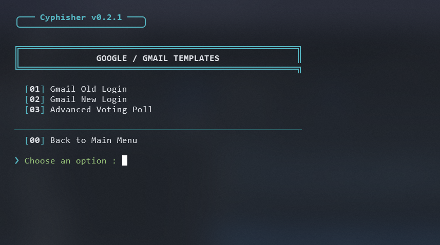

<!-- Cyphisher README -->


<p align="center">
  
  
  
  
  
</p>

<p align="center">
  
  
  
  
</p>

<p align="center"><b>Cyphisher is a next-generation security auditing and penetration testing framework designed to simulate real-world social engineering attacks with a seamless, highly automated terminal interface.</b></p>

##

### 🖼️ Intuitive UI & Deep Customization
<p align="center">
  
</p>

<p align="center">
  
</p>

##

### ⚠️ Legal Disclaimer

<i>Cyphisher was developed strictly for **educational purposes, ethical hacking, and authorized penetration testing**. By using this tool, you agree that any actions you take are solely your own responsibility.

**Unauthorized access to computer systems and social media accounts is illegal.** The creators and contributors of this repository are **not** responsible for any damages, misuse, or illegal activities conducted with this framework. Always ensure you have explicit written permission from the target before performing any security audits.</i>

##

### 🚀 What's New in Cyphisher v0.2.1?

Cyphisher is a massive upgrade over legacy phishing tools, introducing a completely rebuilt architecture focused on stability and user experience:

- **Next-Gen Terminal Interface:** Forget boring static text. Enjoy smooth typewriter animations, dynamic block loading bars, and sleek box-drawn menus.
- **Intelligent Error Recovery:** 
  - **Dynamic Port Allocation:** If your selected port is blocked or in use, Cyphisher automatically scans and re-assigns a free port instantly.
  - **Fail-Safe Tunnels:** Automatically detects segmentation faults or crashed tunneling binaries and safely redirects you back to the menu instead of crashing the script.
- **Zombie Process Elimination:** A completely rewritten interrupt trap ensures that all background PHP servers and rogue SSH instances are aggressively terminated upon exiting.
- **Smart Connectivity:** Automatically disables internet-dependent features when operating in offline/local-network mode.

##

### 🎯 Key Capabilities

- **30+ Premium Templates:** High-fidelity, modern login pages for major platforms.
- **Plug-and-Play Setup:** Zero manual configuration required. Dependencies are automatically managed and installed on the first run.
- **Integrated Tunneling Engines:**
  - Localhost (For local network testing)
  - Cloudflare (Automated configuration)
  - LocalXpose
  - Localhost.run (Native SSH tunneling)
- **URL Masking:** Built-in support for generating stealthy URLs.

##

### ☁️ Run in the Cloud

You can launch and test Cyphisher directly in your browser without installing anything on your local machine using Google Cloud Shell:

<p align="left">
  <a href="https://shell.cloud.google.com/cloudshell/open?cloudshell_git_repo=https://github.com/AsHfIEXE/Cyphisher.git&tutorial=README.md" target="_blank"></a>
</p>

##

### 🛠️ Local Installation

Deploying Cyphisher locally is incredibly straightforward:

1. **Clone the repository:**
   ```bash
   git clone --depth=1 https://github.com/AsHfIEXE/Cyphisher.git
   ```

2. **Navigate and execute:**
   ```bash
   cd Cyphisher
   bash Cyphisher.sh
   ```

*On your first launch, Cyphisher will automatically scan your system and install any missing dependencies.*

##

### 📱 Android Installation (via Termux)

Install Cyphisher instantly using our custom APT repository (no waiting for official approvals):

```bash
echo "deb [trusted=yes] https://ashfiexe.github.io/Cyphisher/ ./" > $PREFIX/etc/apt/sources.list.d/cyphisher.list
pkg update
pkg install cyphisher
cyphisher
```
*(Please adhere to Termux's community guidelines regarding security tools).*

##

### 🐳 Docker Deployment

For sandboxed execution, you can run Cyphisher inside a Docker container directly from Docker Hub:

- **Pull the official image:**
  ```bash
  docker pull ashfiexe/cyphisher
  ```

- **Launch the container interactively:**
  ```bash
  docker run --rm -ti -v $(pwd)/auth:/opt/Cyphisher/auth ashfiexe/cyphisher
  ```
  *(The `-v` flag ensures that any captured credentials are saved to your local `auth` directory).*

##

<details>
  <summary><h3>📦 System Requirements</h3></summary>

Cyphisher requires the following core utilities:
- `git`
- `curl`
- `php`
- `unzip`

*Note: The setup script will attempt to install these automatically if they are missing.*
</details>

<details>
  <summary><h3>💻 Supported Platforms</h3></summary>

Cyphisher has been successfully tested on:
- **Ubuntu / Debian**
- **Arch Linux / Manjaro**
- **Fedora**
- **Termux (Android)**
- **Windows Subsystem for Linux (WSL)**
</details>

##

### 📞 Connect & Contribute
<p align="left">
  <a href="https://github.com/AsHfIEXE" target="_blank"></a>
</p>

### 💖 Acknowledgements

A special thanks to the security research community and all contributors who help improve this tool:

<table>
  <tr align="center">
    <td><a href="https://github.com/AsHfIEXE"><br /><sub><b>AsHfIEXE</b></sub></a></td>
  </tr>
</table>

<!-- EOF -->
